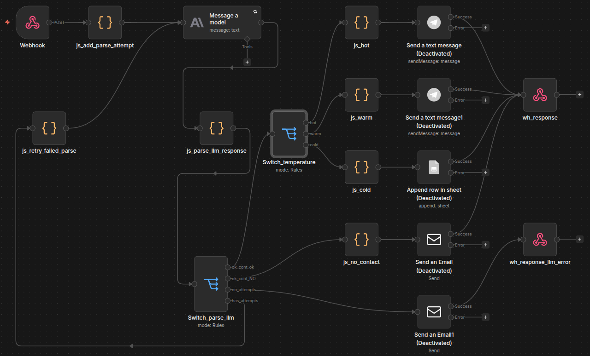
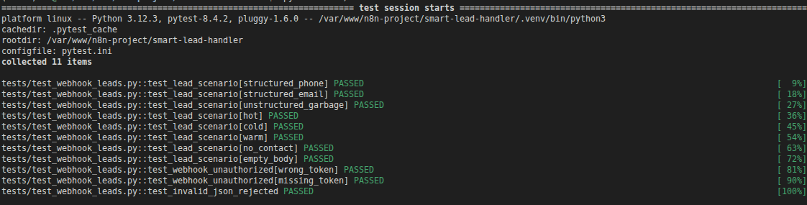

# Умный обработчик лидов

Заявки с сайта приходят на **Webhook** в разном формате: структурированный JSON, только email, неструктурированный текст. **n8n** с LLM извлекает контакт и намерение, классифицирует лид (**hot / warm / cold**), формирует черновик ответа и маршрутизирует по веткам (менеджер, лог, администратор при отсутствии контакта). **pytest** проверяет JSON-ответ production webhook.

## Стек

| Компонент | Назначение |
| --------- | ---------- |
| **n8n** | Webhook, ветвление, Respond to Webhook, Telegram / Sheets / SMTP |
| **Anthropic (n8n)** | Парсинг и классификация через API, совместимый с Anthropic Messages (`anthropic/claude-haiku-4.5`) |
| **Python, pytest, requests** | 11 сценариев, POST на webhook |
| **Header Auth** | `X-Webhook-Token` — без токена workflow не стартует (403) |

В credentials ноды Anthropic задаётся свой **Base URL** провайдера LLM.

## Схема workflow (n8n)

Полный граф в редакторе n8n (Webhook → LLM → проверка парсинга/контакта → Switch по temperature → Respond to Webhook).



```text
Webhook (Header Auth)
  → LLM (извлечение JSON: контакт, продукт, temperature, draft_reply)
  → проверка парсинга (до 3 попыток) и наличия контакта
  → hot / warm → выход «менеджеру» (Telegram)
  → cold → лог / таблица (Google Sheets)
  → нет контакта → email админу (SMTP)
  → Respond to Webhook (единый JSON клиенту)
```

## Ответ webhook (контракт)

Успешный ответ — JSON с полями: `ok`, `branch`, `temperature`, `contact_found`, `name`, `product`, `client_interest`, `draft_reply`, `contact` (`email`, `phone`).

| `branch` | Смысл |
| -------- | ----- |
| `hot_output` | Срочный лид |
| `warm_output` | Заинтересован, без срочности |
| `cold_log` | Низкий приоритет, в лог/таблицу |
| `no_contact` | Контакт не найден — ветка администратора |

Для лидов с контактом `branch` соответствует `temperature`: hot → `hot_output`, warm → `warm_output`, cold → `cold_log`.

## Каталог услуг

Чат-бот для сайта, контакт-центр с ИИ, SMM-сопровождение, разработка сайта, MAX-боты для бизнеса, аудит бизнес-процессов.

## Структура репозитория

```text
smart-lead-handler/
├── README.md
├── requirements.txt
├── .env.example
├── pytest.ini
├── docs/
│   ├── workflow.png
│   └── pytest-passed.png
├── workflows/
│   └── n8n_workflow_smart_lead_handler.json
└── tests/
    ├── conftest.py
    ├── test_webhook_leads.py
    └── payloads/
```

## Быстрый старт

### n8n

1. Импортируйте `workflows/n8n_workflow_smart_lead_handler.json`.
2. Настройте credentials: **Header Auth** (`X-Webhook-Token`) и **Anthropic** (модель + Base URL провайдера).
3. Опубликуйте workflow (**Publish**) — для pytest нужен production URL (`/webhook/...`).

### Тесты

Склонируйте репозиторий, создайте venv и установите зависимости:

```bash
cd smart-lead-handler
python3 -m venv .venv
source .venv/bin/activate
pip install -r requirements.txt
cp .env.example .env
```

В `.env`:

| Переменная | Описание |
| ---------- | -------- |
| `N8N_WEBHOOK_URL` | Production URL (`/webhook/...`), workflow опубликован (**Publish**) |
| `X_WEBHOOK_TOKEN` | Секрет, как в Header Auth ноды Webhook |
| `HTTP_TIMEOUT` | Таймаут запроса, по умолчанию 120 с |

Не используйте `/webhook-test/...` для pytest — только production webhook.

```bash
pytest tests/ -v
```

Тесты выполняются последовательно; каждый ждёт ответа workflow. Без `.env` — `skip`.

## Покрытие тестами

**11 тестов** — `tests/test_webhook_leads.py`, payload в `tests/payloads/`.

| id | Payload | Проверка |
| -- | ------- | -------- |
| `structured_phone` | `01_structured_phone.json` | контакт, схема, `branch` ↔ `temperature` |
| `structured_email` | `02_structured_email.json` | + `contact.email` заполнен |
| `unstructured_garbage` | `03_unstructured_garbage.json` | контакт из неструктурированного текста |
| `hot` | `04_hot_lead.json` | `hot_output`, контакт заполнен |
| `cold` | `05_cold_lead.json` | `cold_log` |
| `warm` | `06_warm_lead.json` | `warm_output` |
| `no_contact` | `07_no_contact.json` | `no_contact` |
| `empty_body` | `08_empty.json` | `no_contact` |
| `wrong_token` / `missing_token` | любой payload | HTTP **403**, plain text |
| `invalid_json` | тело `not-json{` | HTTP **422**, `Failed to parse request body` |

## Результаты прогона

Production webhook:

| Метрика | Значение |
| ------- | -------- |
| Статус | **11 passed** |
| Время | ~24 с |
| Python | 3.12.3, pytest 8.4.2 |

Полный вывод pytest
